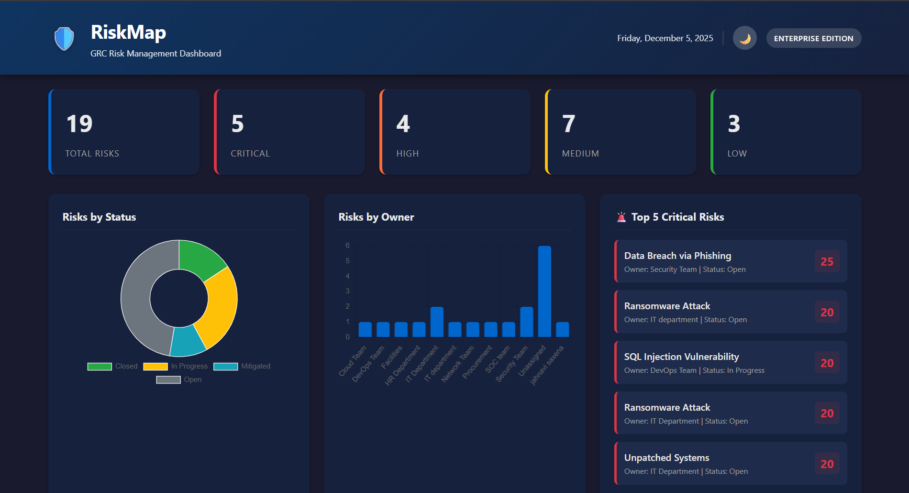

# RiskMap - GRC Automation Tool 🛡️

[](https://www.python.org/downloads/)
[](https://opensource.org/licenses/MIT)
[](https://flask.palletsprojects.com/)

A powerful Governance, Risk, and Compliance (GRC) tool featuring both a **CLI** for command-line operations and a **Web Dashboard** for visual risk management.



## 🚀 Features

### CLI Tool
- 📊 **Risk Management**: Add, list, score, and delete risks
- 🤖 **AI-Powered Mapping**: Intelligent control mapping using OpenAI GPT-4o-mini
- 🔄 **Multi-Framework Support**: SOC 2 and ISO 27001
- 📁 **Export**: Generate audit-ready reports in CSV, JSON, or PDF

### Web Dashboard
- 📈 **Visual Analytics**: Charts for risks by status and owner
- 🗺️ **Risk Heat Map**: Interactive 5x5 likelihood vs impact matrix
- 🌙 **Dark Mode**: Toggle between light and dark themes
- 🚨 **Top 5 Critical Risks**: Quick view of highest priority items

---

## 📦 Installation

### Option 1: Install CLI via pip (Recommended)

```bash
pip install git+https://github.com/jahnavisaxena/RiskMap.git
```

After installation, use the `riskmap` command anywhere:
```bash
riskmap add "Data Breach" --likelihood 4 --impact 5
riskmap list
riskmap export --format pdf
```

### Option 2: Clone and Run Locally

```bash
# Clone the repository
git clone https://github.com/jahnavisaxena/RiskMap.git
cd RiskMap

# Install dependencies
pip install -r requirements.txt

# Run CLI
python main.py list

# Run Web Dashboard
python app.py
# Visit http://localhost:5000
```

### Option 3: Kali Linux / Ubuntu (Virtual Environment)

```bash
# Clone the repository
git clone https://github.com/jahnavisaxena/RiskMap.git
cd RiskMap

# Create and activate virtual environment
python3 -m venv venv
source venv/bin/activate

# Install dependencies
pip install -r requirements.txt

# Run Web Dashboard
python app.py
```

---

## 🖥️ CLI Usage

### Basic Commands

| Command | Description |
|---------|-------------|
| `riskmap add "Risk Name" -l 4 -i 5` | Add a new risk |
| `riskmap list` | List all risks |
| `riskmap delete <id>` | Delete a risk by ID |
| `riskmap export --format csv` | Export to CSV |
| `riskmap export --format pdf` | Export to PDF |

### Add a Risk (SOC 2)
```bash
riskmap add "Data Breach" --likelihood 4 --impact 5
```

### Add a Risk (ISO 27001)
```bash
riskmap add "SQL Injection" --desc "Web app vulnerable" --likelihood 5 --impact 5 --framework iso27001
```

### Add a Risk (HIPAA)
```bash
riskmap add "Unencrypted Patient Data" --likelihood 5 --impact 5 --framework hipaa
```

### Add a Risk (NIST CSF)
```bash
riskmap add "Lack of Incident Response Plan" --likelihood 4 --impact 4 --framework nist
```

### Enable AI-Powered Mapping

Set your OpenAI API key:

**Windows PowerShell:**
```powershell
$env:OPENAI_API_KEY="sk-..."
```

**Linux/Mac:**
```bash
export OPENAI_API_KEY="sk-..."
```

---

## 🌐 Web Dashboard

Start the web server:
```bash
python app.py
```

Open [http://localhost:5000](http://localhost:5000) in your browser.

### Dashboard Features:
- **Stat Cards**: Total, Critical, High, Medium, Low risk counts
- **Charts**: Risks by Status (doughnut) & Risks by Owner (bar)
- **Heat Map**: Visual risk matrix (Likelihood × Impact)
- **Risk Register**: Full table with CRUD operations
- **Dark Mode**: 🌙 Toggle in header

---

## 📁 Project Structure

```
RiskMap/
├── app.py                    # Flask web server
├── main.py                   # CLI entry point
├── setup.py                  # pip installation config
├── requirements.txt
├── src/
│   ├── riskmap/
│   │   ├── cli.py           # CLI commands (Typer)
│   │   ├── risk_manager.py  # Risk CRUD operations
│   │   ├── risk_scoring.py  # Scoring logic
│   │   ├── control_mapper.py# AI + keyword mapping
│   │   └── register_exporter.py
│   └── data/
│       ├── soc2_controls.json
│       └── iso27001_controls.json
├── static/
│   ├── css/style.css
│   └── js/app.js
├── templates/
│   └── index.html
└── tests/
    └── test_core.py
```

---

## 🛠️ Technologies

| Technology | Purpose |
|------------|---------|
| **Python 3.8+** | Core language |
| **Flask** | Web framework |
| **Typer + Rich** | Beautiful CLI |
| **Chart.js** | Dashboard charts |
| **OpenAI GPT-4o-mini** | AI control mapping |
| **Pandas** | Data manipulation |
| **ReportLab** | PDF generation |

---

## 🔧 Frameworks Supported

- **SOC 2**: Common Criteria (CC) controls
- **ISO 27001**: Annex A controls
- **HIPAA**: Security Rule safeguards
- **PCI-DSS v4.0**: Payment card industry standards
- **GDPR**: Data protection & privacy articles
- **NIST CSF**: Identify, Protect, Detect, Respond, Recover

---

## 📄 License

MIT License - feel free to use for personal and commercial projects.

---

## 👩‍💻 Author

**Jahnavi Saxena**


---

## 🤝 Contributing

1. Fork the repository
2. Create a feature branch (`git checkout -b feature/amazing-feature`)
3. Commit changes (`git commit -m 'Add amazing feature'`)
4. Push to branch (`git push origin feature/amazing-feature`)
5. Open a Pull Request
